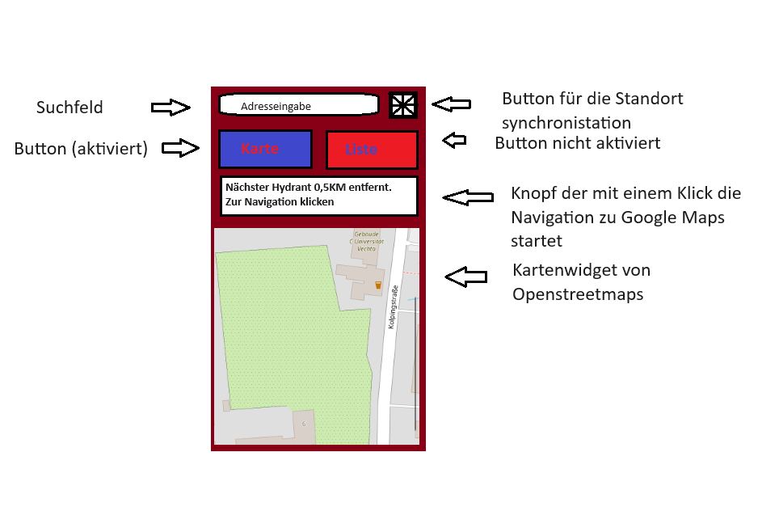
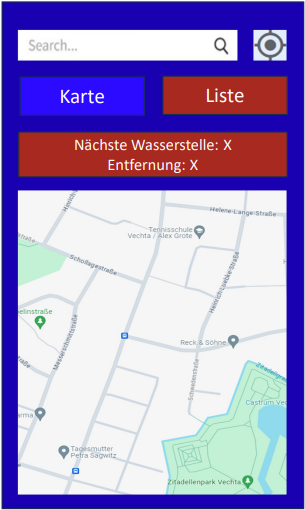
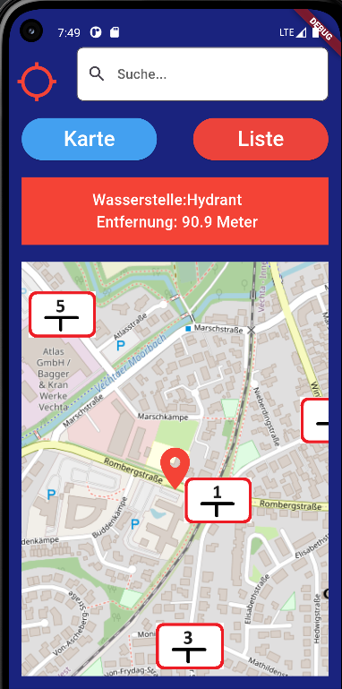
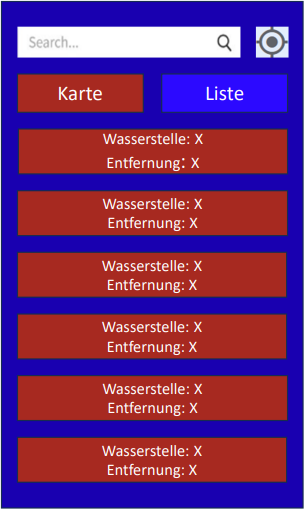
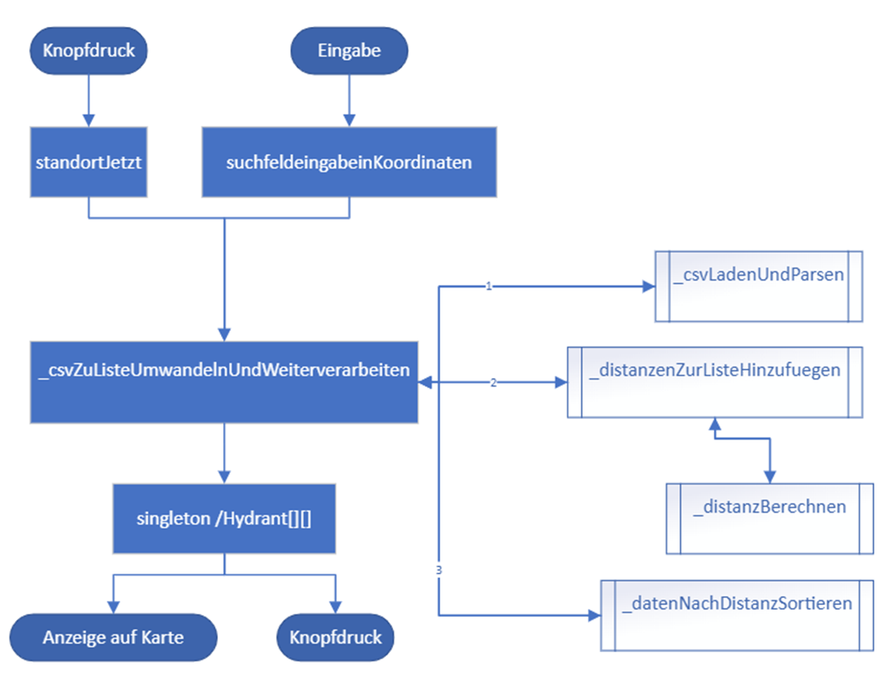

# Entwicklung einer Hydrantensuchapp für die Nutzung als Feuerwehrmann

## 1. Einleitung

Bei einem Einsatz ist eine schnelle Reaktion der Feuerwehr von entscheidender Bedeutung, um potenzielle Schäden so gering wie möglich zu halten. Dies stellt insbesondere für Freiwillige Feuerwehren eine Herausforderung dar, da die meisten Feuerwehrleute nebenbei noch einer Hauptbeschäftigung nachgehen und sich selten unmittelbar am Feuerwehrhaus aufhalten. Dies führt zu wertvollen Zeitverlusten, die über Leben und Tod oder den Unterschied zwischen einem Kleinbrand und der vollständigen Zerstörung eines Wohngebäudes entscheiden können. Auch bei der Ankunft am Einsatzort muss zunächst ein Überblick über die Situation und die Wasserversorgung gewonnen werden. Derzeit geschieht dies über einen Ordner mit verschiedenen Kartenabschnitten der Stadt oder des Dorfes. Die Suche nach dem richtigen Planquadrat und das letztendliche Auffinden des Hydranten kostet jedoch erneut wertvolle Zeit. Diese App zielt darauf ab, diese Zeit auf ein Minimum zu reduzieren und somit Leben zu retten und Schäden zu minimieren.

### 1.1. Anforderungsübersicht

Die primäre Anforderung besteht darin, eine App zur vereinfachten Suche nach Hydranten zu entwickeln, die unmittelbar die nächstgelegenen Hydranten anzeigt und auf Knopfdruck eine Navigation zu dem ausgewählten Hydranten startet. Ein zusätzliches Merkmal sollte eine Kartenübersicht sein, die es ermöglicht, weitere Hydranten zu finden, die zwar nicht die nächstgelegenen, aber für den Einsatz besser geeignet sind, beispielsweise weil der nächstgelegene Hydrant hinter Bahnschienen liegt. Die App sollte zudem so gestaltet sein, dass sie einfach und intuitiv zu bedienen ist, da die Feuerwehrleute im Einsatz unter Stress stehen und keine Zeit haben, sich ausführlich in die Nutzung der App einzuarbeiten. Darüber hinaus ist es wichtig, die Kosten so gering wie möglich zu halten, da Gemeinden trotz der inhärenten Vorteile nicht bereit sind, Geld für Apps auszugeben.

### 1.2. Qualitätsziele

Um einen Feuerwehreinsatz optimal zu unterstützen, ist es von entscheidender Bedeutung, dass die App schnell und möglichst stabil funktioniert. Abstürze und lange Ladezeiten können im Ernstfall Menschenleben gefährden, daher ist es unerlässlich, solche Probleme zu vermeiden. Darüber hinaus muss die App mit Android 10 kompatibel sein, um eine möglichst breite Nutzerbasis unter den Feuerwehrleuten zu gewährleisten und gleichzeitig die Integration neuester Sicherheitsfunktionen zu ermöglichen.

## 2. Der Designprozess und die zugrundeliegenden Konzepte des Enddesigns

Im Zuge des Designprozesses unserer App wurden drei zentrale Ziele festgelegt. Erstens, die Implementierung von ausreichend großen Bedienelementen, um eine problemlose Interaktion auch mit Lederhandschuhen zu ermöglichen. Zweitens, die Etablierung einer einheitlichen Farbstruktur, um die Benutzerfreundlichkeit und Übersichtlichkeit zu optimieren. Drittens, die Reduzierung auf das Wesentliche, um eine klare und übersichtliche Benutzeroberfläche zu gewährleisten. Diese zielgerichteten Designentscheidungen tragen dazu bei, die Benutzererfahrung zu verbessern und die Effizienz der App zu steigern.

## 2.1 Gestaltung der Karten-Seite

*Erster Entwurf der Kartenseite*

*Mockup der Kartenseite*

*Endgültiges Design der Kartenseite*

Die Gestaltung der Karten-Seite ist in vier Hauptbereiche unterteilt: die Appbar, die Navigation, den Weiterleitungsknopf und die Karte selbst.

Die Appbar besteht aus einem Icon-Button und einem Suchfeld. Der Icon-Button verwendet ein standardmäßiges location_searching Icon aus der Material-Bibliothek. Um eine konsistente Farbstruktur zu gewährleisten, sind alle ausführbaren Buttons in Rot gehalten, einschließlich dieses Icon-Buttons. Mit einer Größe von 50 Pixeln erfüllt er zudem das Designziel der großen Buttons. Das Suchfeld hingegen ist in Schwarz-Weiß gehalten, was zwar nicht der einheitlichen Farbstruktur entspricht, aber einen besseren Wiedererkennungswert bietet.

Die Navigation besteht aus zwei Elevated Buttons: dem Button “Karte”, der hellblau ist und daher nicht ausführbar ist, und dem Button “Liste”, der rot und somit ausführbar ist.

Der Weiterleitungsknopf ist ebenfalls rot und daher drückbar. Er ist als großes Quadrat gestaltet, um das Ziel der Bedienbarkeit mit Lederhandschuhen zu erfüllen. Innerhalb dieses Quadrats befinden sich zwei Zeilen: In der ersten Zeile wird die Art der Wasserstelle (meist Hydranten, aber auch Brunnen oder Zisternen) genannt, in der zweiten Zeile wird die Entfernung in Metern angegeben. Die Angabe in Metern ist sinnvoll, da Hydranten in offenen Wohngebieten maximal 140 Meter voneinander entfernt sein dürfen. Auf der Karten-Seite wird nur der nächstgelegene Hydrant angezeigt.

Die Karte selbst besteht aus dem Tile-Layer von OpenStreetMap und sechs verschiedenen Markern. Fünf der Marker sind selbst erstellte Hydrantenschilder, die die einzelnen Hydranten nach Entfernung sortieren. Der verbleibende Marker ist ein location_on Icon aus der Material-Bibliothek, das den gesuchten oder aktuellen Standort anzeigt.

### 2.2. Gestaltung der Listen-Seite

*Mockup der Listen-Seite*

*Endgültiges Design der Listenseite*

Die Liste wurde konzipiert, um die Auswahl von vier zusätzlichen Hydranten zu ermöglichen. Obwohl eine umfangreichere Liste mit mehr Hydranten theoretisch sinnvoll erscheinen könnte, erweist sich die Navigation durch diese mit einem Lederhandschuh als herausfordernd. Daher wurde die Entscheidung getroffen, lediglich fünf große rote Knöpfe zu verwenden, ähnlich denen auf der Karten-Seite, um einen Hydranten auszuwählen, der nicht der nächstgelegene ist. Sowohl die Appbar als auch der Hintergrund weisen keine Unterschiede zur Karten-Seite auf. Die Navigation hingegen ist farblich einfach invertiert.

## 3. Externe Ressourcen

### 3.1. Geolocator

Das Geolocator-Paket von Flutter, eine hochentwickelte Bibliothek von Google, bietet eine Vielzahl von Standortfunktionen für Flutter-Anwendungen. In der vorliegenden Anwendung wurden insbesondere die Funktionen distanceBetween() und getCurrentPosition() implementiert.

Die Funktion distanceBetween() berechnet die direkte Entfernung zwischen zwei gegebenen Koordinatenpaaren. Sie nimmt als Parameter den Breiten- und Längengrad des Startpunktes sowie den Breiten- und Längengrad des Endpunktes entgegen und gibt einen double-Wert zurück, der die berechnete Entfernung repräsentiert.

Die Funktion getCurrentPosition(), hingegen, erfasst die Standortdaten des GPS-Sensors des Smartphones und konvertiert diese Daten in Koordinaten. Der einzige Parameter, der hier angegeben werden kann, ist die desiredAccuracy, die die gewünschte Genauigkeit der Standortdaten bestimmt. Diese Funktion ermöglicht es der Anwendung, den aktuellen Standort des Benutzers mit der angegebenen Genauigkeit zu ermitteln.

### 3.2. http

Die http-Bibliothek von Flutter ermöglicht es, HTTP-Anfragen aus einer Flutter-Anwendung heraus zu senden. Dies eröffnet die Möglichkeit, REST-APIs aufzurufen. Das Paket stellt verschiedene Anfragefunktionen bereit, darunter GET, POST, PUT und DELETE. Darüber hinaus können Header-Informationen extrahiert werden. In der vorliegenden Anwendung wird ausschließlich die GET-Methode verwendet, um eine API-Anfrage zu senden und die Ergebnisse zu empfangen.

### 3.3. csv

Die Flutter-Bibliothek “csv” ermöglicht Entwicklern das Lesen und Schreiben von CSV-Dateien in ihren Flutter-Anwendungen. CSV steht für “Comma-Separated Values” und ist ein einfaches Dateiformat, das zur Speicherung von tabellarischen Daten in Textform verwendet wird. Die “csv”-Bibliothek stellt verschiedene Funktionen zum Parsen und Konvertieren von CSV-Dateien zur Verfügung.

In der betreffenden Anwendung wird die Funktion CsvToListConverter() verwendet, welche die CSV-Datei in eine Liste umwandelt. Als Parameter wird der “fieldDelimiter” angegeben. Im Anschluss wird die Unterfunktion convert() aufgerufen, bei der der Parameter der zu konvertierenden Datei angegeben wird.

### 3.4. URL Launcher

“url_launcher” ist eine Flutter-Bibliothek, die Entwicklern die Möglichkeit bietet, URLs zu öffnen, E-Mails zu versenden, Anrufe zu tätigen und SMS-Nachrichten zu senden. Sie stellt eine plattformübergreifende Schnittstelle zur Verfügung, um externe Ressourcen von Flutter-Anwendungen aus zu öffnen und zu interagieren.

In der betreffenden Anwendung wird ausschließlich die Funktion launch() verwendet. Obwohl diese Funktion in neueren Versionen als veraltet gilt, ist sie notwendig, um die Anwendung auf Android 10 lauffähig zu machen. Bei der Verwendung neuerer Versionen wäre es jedoch ratsam, launch() durch launchUrl() zu ersetzen.

### 3.5. Flutter Map

“Flutter Map” ist ein Flutter-Paket, das Entwicklern eine einfache Integration von Karten in ihre Anwendungen ermöglicht. Es bietet eine Reihe von Funktionen, darunter anpassbare Kartenansichten, Interaktivität durch Zoomen und Verschieben, die Möglichkeit, Marker und Overlays zu platzieren, sowie die Integration mit anderen Flutter-Paketen für erweiterte Funktionen. Mit “Flutter Map” können Entwickler maßgeschneiderte und interaktive Kartenanwendungen erstellen, die auf die spezifischen Bedürfnisse ihrer Benutzer zugeschnitten sind. Im Gegensatz zu anderen Kartenpaketen erfordert dieses Paket die Verwendung eines Tile-Layer-Distributors. Dies bietet zwar eine größere Auswahl, kann jedoch auch anfälliger für Probleme sein.

In der betreffenden Anwendung werden die Funktionen dieses Pakets nahezu vollständig genutzt. Als Tile-Distributor wurde der OpenStreetMap Tile-Layer verwendet. Für die Marker wurden eigens erstellte Bilder verwendet.

### 3.6. Latlong2

Das Paket “latlong2” stellt eine Klasse namens LatLng zur Verfügung, die, ähnlich wie im Paket “latlong”, ein Paar von Breiten- und Längengraden repräsentiert. Diese Klasse ermöglicht es Entwicklern, geographische Punkte zu definieren und verschiedene Operationen durchzuführen, wie beispielsweise das Berechnen von Entfernungen zwischen Punkten, das Bestimmen von Richtungen und das Arbeiten mit verschiedenen geographischen Formaten.

In der betreffenden Anwendung dient dies lediglich als Grundbaustein für die Bibliothek “Flutter Map” und hat ansonsten keinen eigenständigen Nutzen.

### 3.7. Nominatim

Die Nominatim-API, eine kostenfreie Schnittstelle basierend auf OpenStreetMap, bietet Entwicklern die Möglichkeit, geographische Daten zu extrahieren. Sie ermöglicht Nutzern die Durchführung von umgekehrter Geokodierung (die Umwandlung von Koordinaten in menschenlesbare Adressen), Geokodierung (die Konversion von Adressen in Koordinaten), die Suche nach Orten und das Abrufen von Postleitzahlen. Die API ist öffentlich zugänglich und in ihrer Grundversion vollständig kostenfrei. Abhängig von den individuellen Anforderungen kann die Rückgabe entweder als GeoJson, Json oder XML Datei erfolgen.

In der vorliegenden Anwendung wird ausschließlich die Standard-Geokodierung verwendet, um Adresseneingaben in Koordinaten zu konvertieren. Die bevorzugte Rückgabeformat ist JSON, da dieses Format eine einfache Weiterverarbeitung ermöglicht.

### 3.8. OpenStreetMap Tile-Layer

Das OpenStreetMap Tile-Layer ist ein Verfahren zur Darstellung von OpenStreetMap-Daten in einer Anwendung. Es funktioniert durch die Darstellung von kleinen quadratischen Bildern, sogenannten Kacheln, die zusammengesetzt eine vollständige Karte ergeben. Die Kacheln repräsentieren verschiedene Abschnitte der Karte und werden kontinuierlich dynamisch geladen.

Die Integration erfolgt über den Link https://tile.openstreetmap.org/{z}/{x}/{y}.png, wobei {z} die Zoomstufe und {x} und {y} die horizontalen und vertikalen Koordinaten der Kacheln darstellen, die die Position auf der Karte angeben.

## 4. Ablauf des Programms

Der Mechanismus zur Suche von Hydranten in der Anwendung wird entweder durch eine Eingabe im Suchfeld oder durch das Betätigen des Standort-Buttons initiiert.

Für den Standort-Button wird die Funktion Geolocator.getCurrentPosition() angewendet, um den aktuellen Standort des Benutzers zu ermitteln. Anschließend wird die Funktion _csvZuListeUmwandelnUndWeiterverarbeiten() mit den ermittelten Koordinaten als Parameter aufgerufen.

Bei einer Eingabe in das Suchfeld wird diese Eingabe zunächst durch den verwendeten Geocoder Nominatim in Koordinaten umgewandelt. Diese Koordinaten werden dann als Parameter an die Funktion _csvZuListeUmwandelnUndWeiterverarbeiten() übergeben.

Die Funktion _csvZuListeUmwandelnUndWeiterverarbeiten() ruft zunächst die Funktion _csvLadenUndParsen() auf, welche die Datei Hydrantendaten.CSV aus dem Rootbundle lädt und anschließend mit dem Werkzeug CsvToListConverter().convert() der CSV-Bibliothek in eine Liste umwandelt und parsed. Die zurückgegebene Liste vom Typ dynamic wird dann an die Funktion _distanzenZurListeHinzufuegen() übergeben, zusammen mit den Koordinaten aus dem Standort-Button oder der Suchfeldeingabe.

Die Funktion _distanzenZurListeHinzufuegen() ruft dann für jeden Datensatz die Funktion _distanzBerechnen() auf, welche die Distanz zwischen den Koordinaten aus der CSV-Datei und den übergebenen Koordinaten berechnet. Dies geschieht mit dem Werkzeug Geolocator.distanceBetween() aus der Geolocator-Bibliothek. Anschließend fügt _distanzenZurListeHinzufuegen() zu jedem Datensatz an der Stelle [i][4] die berechnete Distanz in Metern hinzu.

Schließlich ruft _csvZuListeUmwandelnUndWeiterverarbeiten() die Funktion _datenNachDistanzSortieren(csvData) mit der Liste als Parameter auf. Diese Funktion implementiert einen einfachen Sortieralgorithmus, der die Datensätze in der Liste nach Distanz sortiert und die sortierte Liste zurückgibt.

Nach Abschluss aller Funktionsaufrufe wird die Liste der Variable Hydrant zugewiesen und schließlich zu einem Singleton umgewandelt, um die öffentliche Aufrufbarkeit der Variable zu ermöglichen. Abschließend können die Daten aus der Variable Hydrant sowohl für die Karte als auch für die Liste verwendet werden.

## 5. Durchführung von Laufzeittests

Die aus dem Code resultierende APK wurde auf insgesamt drei Geräten, die vier verschiedene Betriebssysteme nutzen, getestet. Der Testlauf auf dem Pixel 5 wurde jedoch ausschließlich auf einem Emulator innerhalb der Android Studio IDE durchgeführt. Das Xiaomi Poco X3 Pro wurde von einer Person getestet, die bereits mit der Anwendung der App vertraut war. Im Gegensatz dazu wurde der Testlauf auf dem Xiaomi Mi 11T von einer Person durchgeführt, die zuvor keine Erfahrung mit der App hatte. Aufgrund dieser unterschiedlichen Voraussetzungen ergeben sich drei verschiedene Testszenarien, die sich hinsichtlich ihrer Schwerpunkte erheblich voneinander unterscheiden.

### 5.1. Google Pixel 5 Android 10 und Android 13

Die Anwendung, die speziell für dieses Gerät entwickelt wurde, wies weder im Design noch in der Funktion gravierende Fehler auf. Dennoch war die Startzeit der App bemerkenswert lang. Sobald die App jedoch installiert war, arbeiteten alle Funktionen mit hoher Geschwindigkeit. Sowohl die Eingabe aller Buchstaben als auch die Lokalisierung des im Emulator eingetragenen Standortes funktionierten einwandfrei. Eine Internetverbindung zur Nutzung des OpenStreetMap Tile-Layers und der Nominatim API war ebenfalls gegeben. Es ist jedoch zu beachten, dass das Internet des Emulators nicht funktioniert, sollte das Notebook kurzzeitig keine Internetverbindung haben.

### 5.2. Xiaomi Poco X3 Pro Android 11

Der Testlauf mit dem Poco X3 Pro verlief äußerst erfolgreich. Trotz der Einschränkungen beim Sideloading konnte die APK ohne größere Schwierigkeiten installiert werden. Die Anfrage nach Standortberechtigungen wurde zügig gestellt und nach Erhalt der Zustimmung konnten alle Funktionen der App problemlos genutzt werden. Ein geringfügiges Problem trat jedoch bei der Suchleiste auf, wo der Begriff „Suche……“ innerhalb der Leiste leicht nach oben verschoben war. Dies beeinträchtigt die Nutzung nicht, sollte aber bei einer möglichen Weiterentwicklung behoben werden. Ein weiteres kleines Problem besteht darin, dass die Standortabfrage etwa 2-3 Sekunden dauert. Dies ist im Vergleich zur vorherigen Suche immer noch sehr kurz, kann aber schnell zu einer Geduldsprobe werden, wenn man im Einsatz ist. Der Fehler dürfte hier vermutlich auf die eingestellte, sehr hohe Genauigkeit zurückzuführen sein. Daraus ergibt sich das Problem, dass das optimale Gleichgewicht zwischen Genauigkeit und Geschwindigkeit noch nicht gefunden wurde.

### 5.3. Xiaomi Mi 11T Android 13

Im Unterschied zu den anderen Tests wurde dieser Test mit einer Person durchgeführt, die zuvor noch keine Erfahrung mit der App hatte. Daher lag der Fokus hier insbesondere auf der Intuitivität und Benutzerfreundlichkeit. Zudem ermöglichte dieser Ansatz die Identifizierung weiterer Fehler, da eine potenzielle Fehlbenutzung durch den unerfahrenen Nutzer Probleme aufwerfen kann, die bei korrekter Nutzung nicht auftreten würden. In diesem Fall wurden durch die Nutzung keine zusätzlichen Fehler entdeckt. Auch hier war das „Suche……“ leicht verschoben und die Lokalisierung dauerte länger als optimal. Dennoch verlief die Nutzung insgesamt sehr erfolgreich. Alle Funktionen wurden ohne vorherige Einweisung sofort gefunden und funktionierten einwandfrei. Mehrere Feuerwehrleute, die die App auf dem gleichen Smartphone testeten, hoben insbesondere die einfache Handhabung auch mit einem Lederhandschuh hervor. Daher ist eine Betriebsanleitung für die aktuelle Version der App nicht erforderlich.

### 5.4. Schlussfolgerungen aus den Tests

Die durchgeführten Tests haben bestätigt, dass die App, abgesehen von einigen geringfügigen Designfehlern, einwandfrei funktioniert. Die Tests haben zudem gezeigt, dass das Ziel, eine äußerst einfache und benutzerfreundliche App zu entwickeln, die sogar mit einem Feuerwehrhandschuh bedient werden kann, erreicht wurde. Durch die Durchführung von Tests mit mehreren Android-Versionen wurde außerdem sichergestellt, dass die App plattformübergreifend einsetzbar ist.

## 6. Herausforderungen in der Entwicklungsphase

Trotz der Verfügbarkeit von Daten zu Wasserstellen wurde aufgrund bestehender Datenschutzgesetze die Bereitstellung dieser Informationen in CSV-Form abgelehnt. Daher wurde auf öffentlich zugängliche Quellen zurückgegriffen und 25 Wasserstellen manuell ausgewählt. Die Authentizität der Daten wurde überprüft, was einen eingeschränkten Testbetrieb ermöglichte. Eine Erprobung mit mehreren tausend Wasserstellen war jedoch leider nicht möglich. Daher kann für die Funktionalität bei einer Größenordnung von über 25 Wasserstellen keine Garantie übernommen werden.

## 7. Mögliche Erweiterungen

Obgleich die Anwendung bereits den festgelegten Zielen gerecht wird, existieren dennoch Potenziale zur Weiterentwicklung dieses Projekts. Eine solche Verbesserung könnte beispielsweise die Implementierung einer Funktion sein, die es ermöglicht, auf die Positionen von Wasserstellen zu klicken, um detaillierte Informationen wie Standort und Rohrdurchmesser im Falle von Hydranten zu erhalten. Darüber hinaus wäre es von Vorteil, wenn die App die Möglichkeit böte, Adressdaten direkt einzufügen, was die Effizienz steigern und wertvolle Sekunden einsparen könnte. Eine zusätzliche Option könnte die Einrichtung einer Ansicht für die Einsatzleitung sein, die es der Leitung ermöglicht, den Feuerwehrleuten individuelle Positionen zuzuweisen. Dies könnte insbesondere bei größeren Einsätzen zu einer verbesserten Organisation beitragen.
